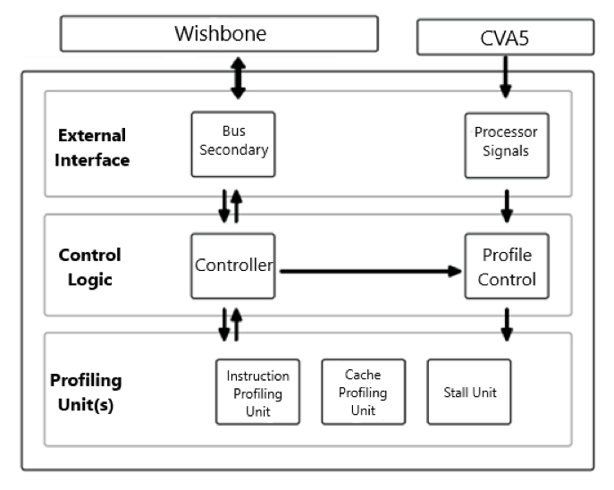

# ABACUS - CPU Profiler for CVA5 Processor

This repository hosts a CPU profiler designed in SystemVerilog that adheres to the [ABACUS (hArdware Based Analyzer for the Characterization of User Software)](https://arxiv.org/abs/1508.07126) framework. This hardware unit provides runtime insights on software execution performance with low overhead, compared to software-based profiling methods. The design profiles the OpenHW CVA5 RISC-V softcore processor on an FPGA using [LiteX](https://github.com/enjoy-digital/litex). Baremetal drivers and dynamic Linux kernel character device drivers are provided as examples.

For more information, please refer to the white paper in `/Documentation/report.pdf`.

## CVA5 Core

The CVA5 processor is a 32-bit RISC-V processor supporting RV32IMAD instructions, with Linux-capable user and supervisor modes. This project uses a custom fork of CVA5, modified to expose profiling nets for the profiler. For further details, visit the CVA5 repository.

## CPU Profiler Design

The high-level overview of the CPU profiler design is shown in the figure below.

  

### Top-Level Design

The top-level design integrates the CPU profiler with the CVA5 processor using a Wishbone interface. This interface allows software running on the CPU to enable or disable profiling units and read performance data from memory-mapped registers. Signals from the processor are analyzed by the profiling units, which are instantiated at the top-level.

### Profiling Units

- **Instruction Profiling Unit**: Monitors issued instructions and categorizes them by type (e.g., Load, Store, Branch). It provides detailed insights into the frequency of each instruction type.
- **Cache Profiling Unit**: Tracks the number of cache requests, hits, and misses, as well as the time taken to refill cache lines after misses. This helps evaluate cache reuse and replacement policies.
- **Stall Unit**: Profiles various causes of pipeline stalls (e.g., branch mispredictions, lack of ready instructions, operands not ready) to assist in reducing pipeline stalls and improving CPU performance.

### Memory Map

                                Top-level registers beginning at `ABACUS_BASE_ADDRESS`:

                                | Register                         | Offset | Access |
                                |-----------------------------------|--------|--------|
                                | Instruction Profile Unit Enable   | 0x004  | R/W    |
                                | Cache Profile Unit Enable         | 0x008  | R/W    |
                                | Stall Unit Enable                 | 0x00c  | R/W    |

---

                                Instruction Profile Unit registers** beginning at `ABACUS_BASE_ADDRESS + 0x100`:

                                | Register                    | Offset | Access |
                                |-----------------------------|--------|--------|
                                | Load Counter                 | 0x000  | R      |
                                | Store Counter                | 0x004  | R      |
                                | Addition Counter             | 0x008  | R      |
                                | Subtraction Counter          | 0x00c  | R      |
                                | Branch Counter               | 0x010  | R      |
                                | Jump Counter                 | 0x014  | R      |
                                | System Privilege Counter     | 0x018  | R      |
                                | Atomic Instruction Counter   | 0x01c  | R      |

---

                                Cache Profile Unit registers** beginning at `ABACUS_BASE_ADDRESS + 0x200`:

                                | Register                        | Offset | Access |
                                |----------------------------------|--------|--------|
                                | ICache Request Counter           | 0x000  | R      |
                                | ICache Hit Counter               | 0x004  | R      |
                                | ICache Miss Counter              | 0x008  | R      |
                                | ICache Line Fill Latency Counter | 0x00c  | R      |
                                | DCache Request Counter           | 0x010  | R      |
                                | DCache Hit Counter               | 0x014  | R      |
                                | DCache Miss Counter              | 0x018  | R      |
                                | DCache Line Fill Latency Counter | 0x01c  | R      |

---

                                Stall Unit registers** beginning at `ABACUS_BASE_ADDRESS + 0x300`:

                                | Register                              | Offset | Access |
                                |----------------------------------------|--------|--------|
                                | Branch Misprediction Counter           | 0x000  | R      |
                                | RAS Misprediction Counter              | 0x004  | R      |
                                | Issue stage, no instruction Counter    | 0x008  | R      |
                                | Issue stage, no ID Counter             | 0x00c  | R      |
                                | Issue stage, flush                     | 0x010  | R      |
                                | Issue stage, unit was busy Counter     | 0x014  | R      |
                                | Issue stage, operands not ready Counter| 0x018  | R      |
                                | Issue stage, hold Counter              | 0x01c  | R      |
                                | Issue stage, multi-source Counter      | 0x020  | R      |

## Software Components

### Baremetal Profiling

The baremetal software directly accesses the profiler's registers using physical memory addresses, enabling low-level performance profiling without an operating system. Code for baremetal profiling is provided in the `SW/baremetal` directory.

### Userspace Software Profiling

In Linux, the profiler is accessed via a character device driver. The driver maps the profiler's physical memory into the Linux kernel's virtual address space, allowing userspace applications to read profiling data and control the profiler via file reads and writes to the driver's file descriptor. Code for Linux-based profiling is available in the `SW/linux` directory.

The table below shows the available commands and their corresponding file descriptor operations:

                                | Command        | Operation |
                                |----------------|-----------|
                                | enable_ip      | write     |
                                | disable_ip     | write     |
                                | enable_su      | write     |
                                | disable_su     | write     |
                                | enable_cp      | write     |
                                | disable_cp     | write     |
                                | get_ip_stats   | read      |
                                | get_su_stats   | read      |
                                | get_icp_stats  | read      |
                                | get_dcp_stats  | read      |

### Further Information

Thank you for visiting this repository, feel free to fork and make your own updates! If you have any questions, I encourage you to look at the White Paper at `Documentation/report.pdf` for more information, and if you happen to have further questions or comments, please raise an Issue.